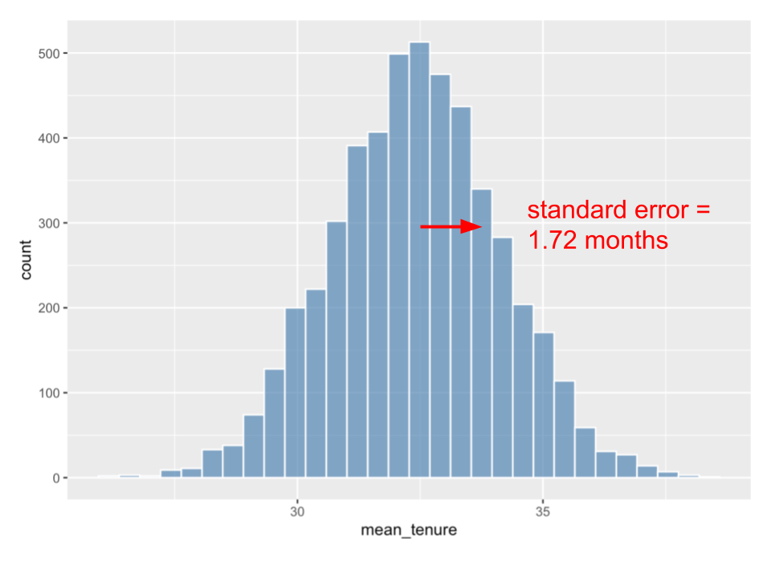

<div class="blame">
author: "Del Middlemiss"<br>
date: "30th August 2019"
</div>


```{r setup, include=FALSE}
knitr::opts_chunk$set(echo = TRUE, fig.align = 'center')
```

# Learning objectives

* Understand the concept of a confidence interval.
* Understand and be able to perform bootstrap resampling.
* Gain experience with the `infer` package.
* Be able to calculate confidence intervals.

**Duration - 90 minutes**<br>

<hr>

# Confidence level and confidence interval

Often we might like an indication of the uncertainty associated with a point estimate of a parameter.

Let's return to the `tenure` variable in the `telecomms_churn` dataset. We take a $200$-observation sample of the population and calculate the `mean(tenure)` of this sample. This is our **point estimate** of the mean `tenure` in the population given this sample.

Using the methods we'll discuss below, we can go on to make helpful statements like:

<br>
<center>
From our $200$-observation sample, the point estimate of `mean(tenure)` is $32.6$ months<br> with a $95\%$ **confidence interval** of $[29.1 \textrm{ to } 36.1]$ months<br><br>
and<br><br>
From our $200$-observation sample, the point estimate of `mean(tenure)` is $32.6$ months<br> with a $99\%$ **confidence interval** of $[28.1 \textrm{ to } 37.1]$ months<br><br>
</center>
<br>

i.e. we would like to be able to state a **likely range** of mean values and/or other statistics! 

Now, in this case, we know from the last lesson that the actual population parameter is $32.37115$ months. But remember, we will never have privileged information like this in real situations. Normally, all we have is **one** sample from which we calculate **one** point estimate. However, **confidence intervals (CIs)** give us a sense of the 'variability' or 'uncertainty' or 'reasonable range' of an estimate! The CI itself is composed of two values: a **lower bound** and an **upper bound**.

The values '$95\%$' and $99\%$ above are both examples of what is known as a **confidence level**. You can see that as we increase the confidence level, the confidence interval gets wider. This is a consequence of the following logic: if we don't gather any more data, but require more confidence in our estimate of a parameter, the only remaining option is to increase the width of the CI.

<br>
<center>
*Think of this as being like fishing with either a spear or a net. The 'spear' is the point estimate, while the 'net' is the confidence interval. To be more certain of catching a fish, you have to make your net bigger. To have more confidence in a point estimate, you have to make the confidence interval wider.*
</center>
<br>

<hr>

# Interpretation of confidence intervals

The actual interpretation of a CI is slightly subtle. Strictly, we can't really say that *'there is a $95\%$ chance that the population parameter lies inside the CI'*, because this makes it sound like it's the **population parameter that's subject to chance**, which is untrue. If we had the time, energy, breath and money, we could gather all the data and compute the population parameter exactly, with no probability theory needed! 

Instead, it was **our use of random sampling** that introduced the element of chance into the process! 

<br>
<div class='emphasis'>
Think of CIs in this way: 

* Each time we draw a $200$-observation sample, we'll get a **different** point estimate of `mean(tenure)`, and a CI with **different** lower and upper bounds.  

* At $95\%$ confidence level, if we draw $100$ samples and calculate a CI for each, we would expect on average that $95$ of these CIs **would contain** the true population parameter, while $5$ **would not contain** it.  

* 'Confidence' means having confidence in this method to provide CIs having these properties. When we draw a single sample, we don't know whether the particular CI we calculate from that sample will contain the population parameter or not, but we have **confidence** that $95\%$ of such CIs would, so there's a good chance this CI is one of that number.  
</div>
<br>

Phew, like we said, a bit too subtle perhaps! CIs are definitely useful to help us think about the likely range of a population parameter. We can use them to quantify the uncertainty in our estimate of a population parameter. 

<hr>

# Bootstrapping

We've been avoiding a particularly big elephant in the room so far: we keep talking about drawing **multiple samples** from a population, but in reality, we will probably only ever have one sample to work with. If we had more time and money, we might make the sample bigger and thus more representative, but we're not going to be able to sample say $5000$ times from the same population. 

So what do we do if we want to get the details of the sampling distribution? The maths of the central limit theorem and standard errors was worked out before the advent of cheap computing power to give statisticians a way to characterise sampling distributions **without** repeatedly sampling the population, as they had no realistic way to do such resampling at that time.  

Now we have easy access to computing power, so we can use resampling techniques! This is where the concept of **'bootstrapping'** comes into play. The name comes from the old idiom of 'pulling yourself up by your own bootstraps', that is **using your own resources or only what is to hand to make progress**.

<br>
<div class='emphasis'>
**Bootstrap resampling or 'bootstrapping'** is the process of **sampling repeatedly from a single sample (not the population) with replacement**. By doing this, we can generate an approximation of the sampling distribution from our single sample! Typically, thousands of resamples are calculated, which means that we realistically need a computer to use the technique. It's one of the most interesting developments in modern statistics.
</div>
<br>

## Load our single sample

Now we're in the position that we no longer have access to the whole population. We have just a single $200$-observation sample - perhaps because this is all we were able to gather, or all that a client was able to provide.

Let's load the data:

```{r, message=FALSE}
library(tidyverse)
library(janitor)
```


```{r}
sample_200 <- read_csv("data/telecomms_churn_200_sample.csv") %>%
  clean_names()

sample_200 %>%
  glimpse()
```

Now, we would like to calculate the sampling distribution for `mean(tenure)`. We have only this $200$-observation sample to work with, so we are going to use **bootstrapping**: we'll calculate numerous resamples of the sample with replacement. For each resample, we'll calculate the `mean(tenure)`:

```{r}
library(infer)

bootstrap_resample_200 <- sample_200 %>%
  rep_sample_n(size = 200, replace = TRUE, reps = 5000) %>%
  summarise(
    mean_tenure = mean(tenure)
  )
```

As a reminder, here's a plot of the $200$-observation sampling distribution of `mean(tenure)` from the previous lesson, where we sampled the full population $5,000$ times:

```{r, echo=FALSE, fig.cap="**Fig. 1.** The $200$-observation sampling distribution of `mean(tenure)` obtained by resampling the full population $5,000$ times.", out.width = '80%'}

```
<br>
<blockquote class='task'>
**Task - 5 mins**

How close is the bootstrapped sampling distribution of `mean(tenure)` to the one shown above? 

* Plot a histogram of the bootstrapped sampling distribution
* Calculate the standard error in `mean(tenure)` and compare it with the previous value $1.72$ months [remember: this is just the `sd()` of the sampling distribution]

<details>
<summary>**Solution**</summary>

```{r}
bootstrap_resample_200 %>%
  ggplot(aes(x = mean_tenure)) +
  geom_histogram(col = "white", fill = "steel blue", alpha = 0.7)
  
bootstrap_resample_200 %>%
  summarise(stderr = sd(mean_tenure))
```
You should find that the histogram looks pretty similar, and the standard error is close. Hopefully this will help convince you that bootstrapping gives a reasonable estimate of the sampling distribution.

</details>
</blockquote>
</br>

<br>
<div class='emphasis'>
Note in the code above that each resample of the original sample is set to the **same size** as the original sample. This is key to getting the correct sampling distribution! 
</div>
<br>

<br>
<blockquote class='task'>
**Task - 2 mins**  

Why is it important to sample **with replacement** when we get the bootstrap distribution? Have a think and discuss with people around you.  

[**Hint** - what happens if we resample $200$-observations from a $200$-observation sample without replacement?]
<details>
<summary>**Solution**</summary>
If we resample $200$-observations from a $200$-observation sample **without replacement**, we just get the same $200$-observations over and over again. This will lead to no sampling variation: the `mean(tenure)` will always be the same!
</details>
</blockquote>
<br>

# CIs from the bootstrap distribution

## Percentile method - simple demonstration

Let's have a look again at the boostrap sampling distribution for `mean(tenure)`:

```{r}
bootstrap_resample_200 %>%
  ggplot(aes(x = mean_tenure)) +
  geom_histogram(col = "white", fill = "steel blue", alpha = 0.7)
```

For a $95\%$ confidence interval, we want to find the upper and lower bounds that separate the central $95\%$ of the sampling distribution from the $2.5\%$ at either edge. We can do this using the `quantile()` function.

```{r}
ci_95 <- bootstrap_resample_200 %>%
  summarise(
    mean = mean(mean_tenure),
    lower_bound = quantile(mean_tenure, probs = 0.025),
    upper_bound = quantile(mean_tenure, probs = 0.975)
  )

ci_95
```

So we estimate the mean at `r round(ci_95$mean,1)` months, with a $95\%$ confidence interval of [`r round(ci_95$lower_bound, 1)`, `r round(ci_95$upper_bound, 1)`] months.

<br>
<blockquote class='task'>
**Task - 2 mins**  
  
* Try a similar approach to determine the upper and lower bounds of a $99\%$ confidence interval for `mean(tenure)` based on the bootstrap sampling distribution. 
* Compare your calculated bounds to those of the $95\%$ CI - is the $99\%$ CI wider or narrower?  
  
[**Hint** - think about how much of the distribution you want to 'chop off' at either end of the CI]

<details>
<summary>**Solution**</summary>
We want to 'chop' $0.5\%$ off the bottom of the distribution and the same off the top! This corresponds to probabilities of $0.005$ and $0.995$ for the `quantile()` function.  

```{r}
ci_99 <- bootstrap_resample_200 %>%
  summarise(
    mean = mean(mean_tenure),
    lower_bound = quantile(mean_tenure, probs = 0.005),
    upper_bound = quantile(mean_tenure, probs = 0.995)
  )

ci_99
```
Of course, the `mean()` doesn't change, only the upper and lower bounds. 

The $99\%$ CI is **wider** than the $95\%$ CI we calculated earlier, the bounds have moved away from the mean.
</details>
</blockquote>
<br>

## Workflow using the `infer` package

The `infer` package offers a `tidyverse` approach to statistical inference. We'll use it here and in the following lessons on hypothesis tests. As with other packages in the `tidyverse`, it has the main advantage that it provides a consistent interface and workflow, as compared with base `R` functions.

### Calculate the bootstrap distribution

We will use three `infer` functions to calculate the bootstrap sampling distribution. 

i. First, we `specify()` which variable we are interested in. 
ii. Next, we `generate()` the replicate resamples. 
iii. Finally, we `calculate()` the statistic we are interested in for each resample

```{r}
infer_resample <- sample_200 %>%
  specify(response = tenure) %>%
  generate(reps = 5000, type = "bootstrap") %>%
  calculate(stat = "mean")
```

### Calculate the required confidence interval

Next, we calculate the upper and lower bounds of the required CI using `get_confidence_interval()`

```{r}
infer_ci_95 <- infer_resample %>%
  get_confidence_interval(level = 0.95, type = "percentile")

infer_ci_95
```

Argument `level =` adjusts the confidence level: here we opted for a $95\%$ CI. The `type =` argument adjusts the type of CI: we're sticking for now to the "percentile" method, but we'll see another option below. 

Also, if you want to spare your fingers, the `get_ci()` function is an alias for `get_confidence_interval()`!

### Visualise distribution and CI

Next, we can visualise the distribution and the CI, using the `visualise()` and `shade_confidence_interval()` functions.

```{r}
infer_resample %>%
  visualise(bins = 30) +
  shade_confidence_interval(endpoints = infer_ci_95)
```

We need to tell `shade_confidence_interval()` the `endpoints` (i.e. bounds) of the CI. We get these from the output of `get_confidence_interval()` in the last step.

As above, `shade_ci()` is a useful alias for `shade_confidence_interval()`.

### Calculate point estimate

We go back to more basic `dplyr` to calculate the point estimate!

```{r}
infer_resample %>%
  summarise(mean(stat))
```

This is a `mean()` of the means held in the bootstrap sampling distribution. Depending upon what you are trying to do, you might prefer the `mean()` of the original sample

```{r}
sample_200 %>%
  summarise(mean(tenure))
```

<br>
<blockquote class = 'task'>
**Task - 15 mins**  

Now, it's your turn. 

* In the `data` folder you will also find a `csv` file containing a $300$-observation sample. Load it, and use that sample to calculate and visualise a bootstrapped $95\%$ CI for `mean(tenure)` using the `infer` workflow. 
* Also calculate the point estimate of `mean(tenure)`.
* Is the width of the $95\%$ CI for your $300$-observation sample different from that you calculated earlier for a $200$-observation sample?
* If you have time, rerun your code with $400$- and $500$-observation samples (you'll also find `csv`s for these in the `data` folder), and keep note of the CIs you obtain. Is there any trend to the width as sample size changes?

To get you started, here's the code to generate the initial $300$-observation sample:

<details>
<summary>**Solution**</summary>

1. Load data and generate bootstrap distribution

```{r}
sample_300 <- read_csv("data/telecomms_churn_300_sample.csv") %>%
  clean_names()

bootstrap_resample_300 <- sample_300 %>%
  specify(response = tenure) %>%
  generate(reps = 5000, type = "bootstrap") %>%
  calculate(stat = "mean")
```

2. Calculate CI  

```{r}
infer_ci_95_300 <- bootstrap_resample_300 %>%
  get_confidence_interval(level = 0.95, type = "percentile")

infer_ci_95_300
```

3. Visualise bootstrap sampling distribution and CI

```{r}
bootstrap_resample_300 %>%
  visualise(bins = 30) +
  shade_confidence_interval(endpoints = infer_ci_95_300)
```

4. Calculate point estimate

```{r}
bootstrap_resample_300 %>%
  summarise(point_est = mean(stat))
```

or...

```{r}
sample_300 %>%
  summarise(point_est = mean(tenure))
```


5. Here's how the $95\%$ CI changed with sample size in our results. Note that width generally *decreases* as sample size *increases*, but expect noise in your results!

```{r, echo=FALSE, message=FALSE}
sample_400 <- read_csv("data/telecomms_churn_400_sample.csv") %>%
  clean_names()

bootstrap_resample_400 <- sample_400 %>%
  specify(response = tenure) %>%
  generate(reps = 5000, type = "bootstrap") %>%
  calculate(stat = "mean")

infer_ci_95_400 <- bootstrap_resample_400 %>%
  get_confidence_interval(level = 0.95, type = "percentile")


sample_500 <- read_csv("data/telecomms_churn_500_sample.csv") %>%
  clean_names()

bootstrap_resample_500 <- sample_500 %>%
  specify(response = tenure) %>%
  generate(reps = 5000, type = "bootstrap") %>%
  calculate(stat = "mean")

infer_ci_95_500 <- bootstrap_resample_500 %>%
  get_confidence_interval(level = 0.95, type = "percentile")
```


| sample size | $2.5\%$ bound | $97.5\%$ bound | CI width |
| --- | --- | --- | --- |
| 200 | `r (l <- round(infer_ci_95$lower_ci, 1))`	| `r (u <- round(infer_ci_95$upper_ci, 1))` | `r u - l` |
| 300 | `r (l <- round(infer_ci_95_300$lower_ci, 1))`	| `r (u <- round(infer_ci_95_300$upper_ci, 1))` | `r u - l` |
| 400 | `r (l <- round(infer_ci_95_400$lower_ci, 1))`	| `r (u <- round(infer_ci_95_400$upper_ci, 1))` | `r u - l` |
| 500 | `r (l <- round(infer_ci_95_500$lower_ci, 1))`	| `r (u <- round(infer_ci_95_500$upper_ci, 1))` | `r u - l` |

</details>
</blockquote>
<br>

# CI width and sample size

Hopefully you saw in the last task that CI width generally **decreases** as sample size **increases**. This just comes from the fact that the width of the sampling distribution (i.e. the **standard error**) decreases with sample size. In fact, the central limit theorem tells us that the standard error varies as $\frac{1}{\sqrt{\textrm{sample size}}}$, so:

<br>
<div class='emphasis'>
The width of a confidence interval should roughly vary as $\frac{1}{\sqrt{\textrm{sample size}}}$
</div>
<br>

<br>
<blockquote class='task'>
**Task - 2 mins**  

We calculate a CI for the mean of a variable from a $400$-observation sample, but find it is too wide (meaning we can't estimate the mean of the variable with enough precision). There is an opportunity to sample the population again. If we want to **halve** the CI width, roughly what size of sample should we aim for?

Have a think, and discuss with the people around you.

<details>
<summary>**Solution**</summary>
The CI width varies as $\frac{1}{\sqrt{\textrm{sample size}}}$, so if we want to **halve** the CI width, we must **increase** sample width by a factor of approximately $4$ to $1600$-observations.
</details>
</blockquote>
<br>

# CI for a proportion

So far we've been exploring CIs for means, but the workflow for proportions is very similar! Let's see it in action for the `churn` proportion in `single_sample_200`: we'll explain any differences as we go

Calculate the bootstrap sampling distribution

```{r}
# THIS MIGHT TAKE A FEW MINS
# when we specify a categorical response, have to specify a success argument
# the stat we want now is "prop"
bootstrap_resample <- sample_200 %>%
  specify(response = churn, success = "Yes") %>%
  generate(reps = 5000, type = "bootstrap") %>%
  calculate(stat = "prop")
```

Now get the appropriate CI

```{r}
churn_ci_95 <- bootstrap_resample %>%
  get_confidence_interval(level = 0.95, type = "percentile")

churn_ci_95
```

And now visualise the sampling distribution and CI

```{r}
bootstrap_resample %>%
  visualise(bins = 30) +
  shade_confidence_interval(endpoints = churn_ci_95)
```

Finally, calculate the point estimate

```{r}
sample_200 %>%
  summarise(point_est = mean(churn == "Yes"))
```

or...

```{r}
bootstrap_resample %>%
  summarise(point_est = mean(stat))
```

# Extra - Standard error method

The other way to think about the construction of a CI is as:

$$\textrm{confidence interval} = \textrm{point estimate} \pm \textrm{margin of error}$$

The **margin of error** depends upon sample size, standard deviation and confidence level (in fact, it's directly proportional to the standard error). This makes clear that CIs constructed in this way must be **symmetric about the point estimate**: the point estimate will lie exactly in the centre of the CI. 

CIs constructed using the standard error make an assumption about the sampling distribution: they assume that it's **close to normal**. The percentile method above **did not** make this assumption: whatever the shape of the sampling distribution, it chopped the appropriate percentage off the top and bottom to find the upper and lower bounds. The percentile method CI wasn't constrained to be symmetric about the point estimate. 

So the percentile method is **more general** than the standard error method we are about to show: you should usually choose the percentile method in most cases!

<br>
<div class='emphasis'>
The standard error method should only be used when you are satisfied that the sampling distribution is nearly normal. In most cases, the percentile method is superior, and so we would recommend using it instead. 
</div>
<br>

## Margin of error

The $\textrm{margin of error}$ can be calculated this way

$$\textrm{margin of error} = \textrm{multiplier} \times \textrm{standard error}$$

We get the standard error as the `sd()` of the bootstrap sampling distribution, and select the multiplier from the following table.

| confidence level | multiplier |
| --- | --- |
| $90\%$ | 1.64 |
| $95\%$ | 1.96 |
| $99\%$ | 2.58 |

<br>
<details>
<summary>**Where do these multipliers come from?**</summary>
Haha, OK, you asked for it! The multipliers come from the assumption that the sampling distribution is normal. If it is, then we can use the `qnorm()` function to find the $z$-scores marking the upper and lower bounds of the CI. 

For example, for a $95\%$ CI, we want to chop $2.5\%$ off the top and the same amount off the bottom of the standard normal. What $z$-scores does this correspond to?

```{r}
qnorm(0.025)
qnorm(0.975)
```

The bounds occur at $z$-scores of $\pm1.96$. We then turn this back into 'variable' units by reversing the definition of the $z$-score.

$$z = \frac{x-\bar{x}}{s} \implies x = \bar{x}+z \times s$$

i.e.

$$\textrm{upper bound} = \bar{x} + 1.96 \times \textrm{standard error}$$
$$\textrm{lower bound} = \bar{x} - 1.96 \times \textrm{standard error}$$
</details>
<br>

There is a comparable `infer` workflow to use the standard error method to generate a CI. The difference occurs in the arguments passed to `get_confidence_interval()` (or `get_ci()` for short). You need to pass in `type = "se"` and also provide a value for the point estimate. 

For example, for the $95\%$ CI for `prop_churn` using the standard error method: 

```{r}
churn_ci_95_se <- bootstrap_resample %>%
  get_confidence_interval(
    level = 0.95, 
    type = "se", 
    point_estimate = mean(sample_200$churn == "Yes")
  )

churn_ci_95_se
```

<hr> 

# Recap

<br>

* What is a confidence interval?
<details>
<summary>**Answer**</summary>
A confidence interval is defined by a confidence level (e.g. $95\%$ or $99\%$). It is a region calculated so that, e.g. on $95\%$ of attempts, the population parameter will lie within the CI and on $5\%$ of attempts it won't. 
</details>

<br>

* What is bootstrapping?
<details>
<summary>**Answer**</summary>
Bootstrapping is the process of approximating a sampling distribution by drawing repeatedly from a single sample with replacement. It lets us estimate the true sampling distribution we would obtain if we had the full population and could sample repeatedly from it.
</details>

<br>

* If we don't change the sample size, how does the width of a CI vary as we increase confidence level?
<details>
<summary>**Answer**</summary>
The width of the CI **increases** as confidence level increases.
</details>

<br>

* If we don't change the confidence level, how does the width of a CI vary as we increase sample size?
<details>
<summary>**Answer**</summary>
The width of the CI **decreases** as sample size increases.
</details>

<br>

* What is the `infer` workflow to generate a CI?
<details>
<summary>**Answer**</summary>
We `specify()` the variable we are interested in, `generate()` a large number of replicates (e.g. $10,000$), `calculate()` the statistic we are interested in (e.g. the `mean()`) from each replicate. Then we `get_ci()`, and can optionally `visualise()` the sampling distribution, and superimpose the CI with the `shade_ci()` function.

</details>

<br>


